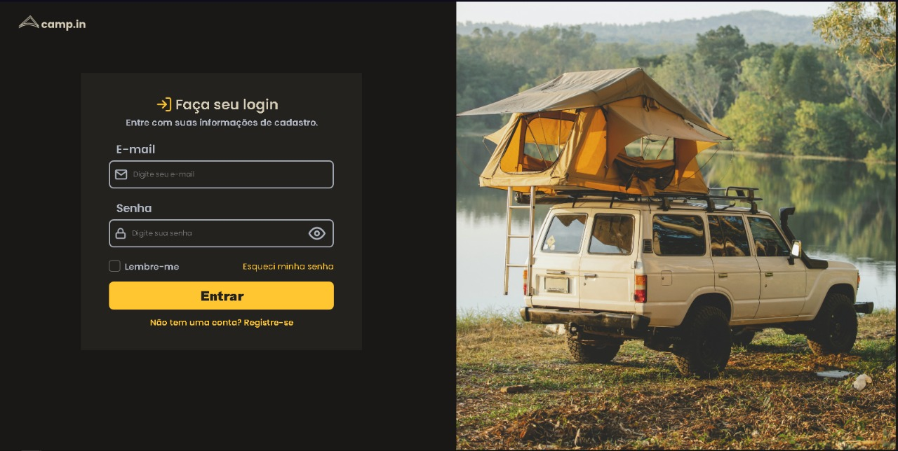
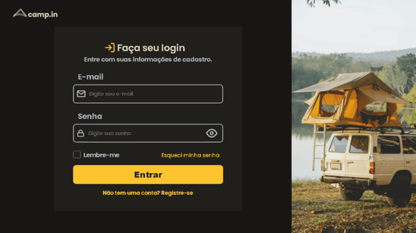

<h1>📲 Login Form Project</h1>
This is a login page project. The project template was based on rocketseat's "challenges"

<h2>📷 Photos</h2>

    
Click here to see the images

    Solarized dark             |  Solarized Ocean
:-------------------------:|:-------------------------:
  |  
    
    

<h2>❔ Why?</h2>
This was my first published project involving html, css and javascript.
Ps: although the code is not perfect, I intend to improve and evolve my projects

<h2>🛠 Tecnologias</h2>

The following tools were used in building the project

- [JavaScript](https://www.javascript.com)
- [Css](https://developer.mozilla.org/pt-BR/docs/Web/CSS)
- [HTML](https://developer.mozilla.org/pt-BR/docs/Web/HTML)

<h2>📒 Template</h2>
https://app.rocketseat.com.br/discover/challenges/login-form-css
